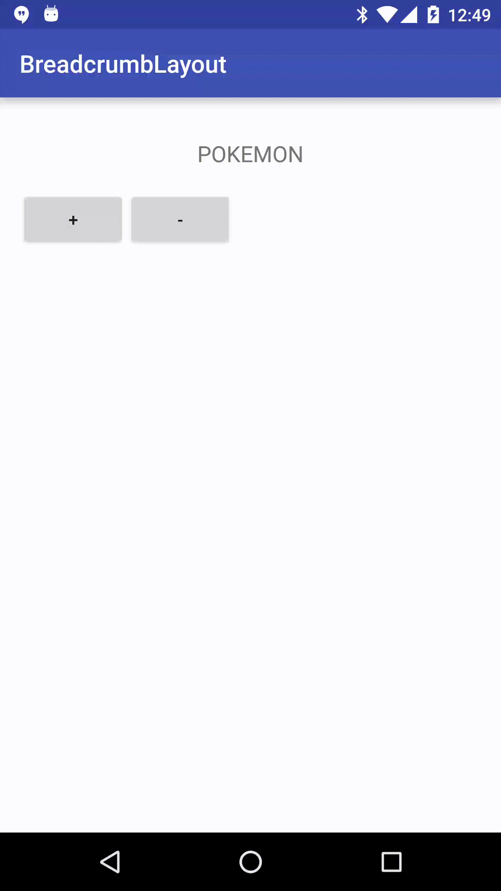

BreadcrumbLayout
================

A simple breadcrumb view based on the design support library's TabLayout



Download
--------

Maven:
```xml
    <dependency>
      <groupId>com.github.ayvazj.android</groupId>
      <artifactId>breadcrumblayout</artifactId>
      <version>0.1.0</version>
    </dependency>
```
or Gradle:
```groovy
    compile 'com.github.ayvazj.android:breadcrumblayout:0.1.0'
```

Usage
-----

Add the following to your layout
--------------------------------

```xml
    <com.github.ayvazj.breadcrumblayout.BreadcrumbLayout
        android:id="@+id/breadcrumbLayout"
        android:layout_width="match_parent"
        android:layout_height="60dp"
        android:background="@android:color/white" />
/>
```

Code
----

```java
    // add a breadcrumb
    breadcrumbLayout.addCrumb(breadcrumbLayout.newCrumb().setText("breadcrumb text"));
    
    // remove a breadcrumb
    breadcrumbLayout.removeCrumbAt(breadcrumbLayout.getCrumbCount() - 1);

    // listen for selections
    breadcrumbLayout.setOnBreadcrumbSelectedListener(new BreadcrumbLayout.OnBreadcrumbSelectedListener() {
        @Override
        public void onBreadcrumbSelected(BreadcrumbLayout.Breadcrumb crumb) {
            if ( crumb.getTag() != null && crumb.getTag() instanceof Pokemon) {
                imageView.setImageResource(((Pokemon)crumb.getTag()).drawableRes);
            }
            else {
                imageView.setImageDrawable(null);
            }
        }
    
        @Override
        public void onBreadcrumbUnselected(BreadcrumbLayout.Breadcrumb crumb) {
    
        }
    
        @Override
        public void onBreadcrumbReselected(BreadcrumbLayout.Breadcrumb crumb) {
    
        }
    });
        

```

License
=======

    Copyright 2016 James Ayvaz.

    Licensed under the Apache License, Version 2.0 (the "License");
    you may not use this file except in compliance with the License.
    You may obtain a copy of the License at

       http://www.apache.org/licenses/LICENSE-2.0

    Unless required by applicable law or agreed to in writing, software
    distributed under the License is distributed on an "AS IS" BASIS,
    WITHOUT WARRANTIES OR CONDITIONS OF ANY KIND, either express or implied.
    See the License for the specific language governing permissions and
    limitations under the License.

